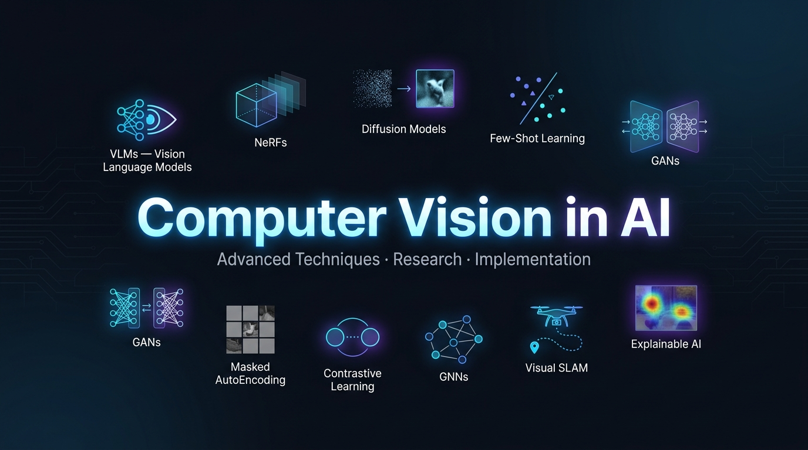

<p align="center">
  
</p>

# Computer Vision in AI


A comprehensive Jupyter Notebook resource covering modern **Computer Vision** concepts and their practical implementations using Python. Designed for learners, researchers, and developers.

---

## Repository Structure

```
Computer-Vision-in-AI/
├── Computer_Vision_in_AI.ipynb   # Main educational notebook
├── main.py                        # Runnable CV demos (CLI)
├── requirements.txt               # Python dependencies
├── LICENSE                        # MIT License
└── README.md                      # This file
```

---

## Topics Covered

| # | Topic | Description |
|---|-------|-------------|
| 1 | **Vision Language Models (VLMs)** | Integrating image recognition with NLP for visual Q&A |
| 2 | **Neural Radiance Fields (NeRFs)** | 3D scene reconstruction from 2D images |
| 3 | **Diffusion Models** | State-of-the-art image generation beyond GANs |
| 4 | **Few-Shot & Zero-Shot Learning** | Learning from minimal labeled examples |
| 5 | **Generative Adversarial Networks (GANs)** | Hyper-realistic image synthesis |
| 6 | **Masked AutoEncoding** | Self-supervised visual representation learning |
| 7 | **Contrastive Learning** | Feature learning via similarity/difference |
| 8 | **Graph Neural Networks (GNNs)** | Scene understanding via relational graphs |
| 9 | **Visual SLAM** | Real-time 3D mapping for autonomous systems |
| 10 | **Explainable AI (XAI) in CV** | Interpretability for trustworthy CV models |

---

## Tech Stack

- **Python 3.8+**
- **Jupyter Notebook / Google Colab**
- **NumPy** — numerical computing
- **OpenCV** — image processing
- **Matplotlib** — visualization
- **scikit-learn** — machine learning utilities
- **PyTorch + torchvision** — deep learning models
- **Pillow** — image I/O

---

## Getting Started

### Open in Google Colab (Recommended)

[](https://colab.research.google.com/github/Imaad18/Computer-Vision-in-AI/blob/main/Computer_Vision_in_AI.ipynb)

### Run Locally

1. **Clone the repository:**
   ```bash
   git clone https://github.com/Imaad18/Computer-Vision-in-AI.git
   cd Computer-Vision-in-AI
   ```

2. **Install dependencies:**
   ```bash
   pip install -r requirements.txt
   ```

3. **Launch the notebook:**
   ```bash
   jupyter notebook Computer_Vision_in_AI.ipynb
   ```

4. **Or run the CLI demos:**
   ```bash
   python main.py
   ```

---

## CLI Demo (`main.py`)

`main.py` provides hands-on demonstrations of core CV techniques:

```bash
python main.py                    # Run all demos
python main.py --demo edges       # Edge detection
python main.py --demo features    # Feature extraction
python main.py --demo segmentation # Color segmentation
python main.py --demo augment     # Data augmentation
python main.py --demo contrastive # Contrastive learning similarity
python main.py --demo gan         # GAN architecture overview
python main.py --demo xai         # Gradient-based saliency map
```

---

## License

MIT License — see [LICENSE](LICENSE) for details.

Copyright (c) 2025 Imaad Mahmood
